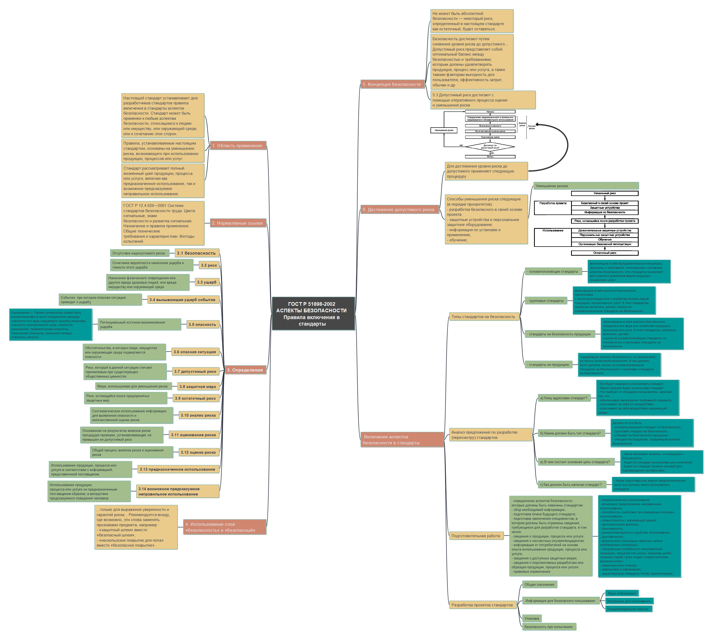

# Создание ментальной карты
Kabanova Svetlana BISO-01-20

## Цель работы

1.  Изучить международные и российские стандарты, связанные с
    информационной безопасностью

2.  Получить навыки систематизации информации с помощью ментальной карты

## Исходные данные

1.  ОС Windows 11

2.  Freeplane

3.  [ГОСТ Р
    51898-2002](https://files.stroyinf.ru/Data2/1/4294845/4294845085.pdf)

## Ход выполнения практической работы

Был ичен документ ГОСТ Р 51898-2002 “АСПЕКТЫ БЕЗОПАСНОСТИ. Правила
включения в стандарты”

На его основе, с помощью программы Freeplane была создана ментальная
карта:

## Оценка результата

В ходе выполнения практической работы была создана ментальная карта
(файл mindmap.mm) по стандарту ГОСТ Р 51898-2002 АСПЕКТЫ БЕЗОПАСНОСТИ.
Правила включения в стандарты

## Выводы

Освоен инструмент Freeplane. Получены навыки создания mindmap.
